# Phase Diagram & Universality

[](https://doi.org/10.5281/zenodo.18751083)
[**Read the paper (PDF)**](latex/paper_en.pdf)

Phase transition universality analysis for the SFC-ABM model of AI-driven labor market automation.

## Campaigns

| # | Campaign | Axes | Runs |
|---|----------|------|------|
| 1 | Phase Diagram | BDP(21) × σ_mult(10) × regime(2) × 30 seeds | 12,600 |
| 2 | Topology Universality | BDP(11) × topology(4) × regime(2) × 30 seeds | 2,640 |
| 3 | Finite-Size Scaling | BDP(11) × N(5) × 30 seeds | 1,650 |
| 4 | Decision Rule Sensitivity | BDP(11) × variant(5) × 30 seeds | 1,650 |
| | **Total** | | **18,540** |

## Prerequisites

Build the fat JAR first:

```bash
cd ../core && sbt assembly
```

## Usage

```bash
# Run everything
make all

# Individual campaigns
bash simulations/scripts/run_campaign1_phase.sh
bash simulations/scripts/run_campaign2_topology.sh
bash simulations/scripts/run_campaign3_fss.sh
bash simulations/scripts/run_campaign4_decision.sh

# Generate figures
make figures

# Compile paper
make paper
```

## Figures

### Phase Diagram (Campaign 1)

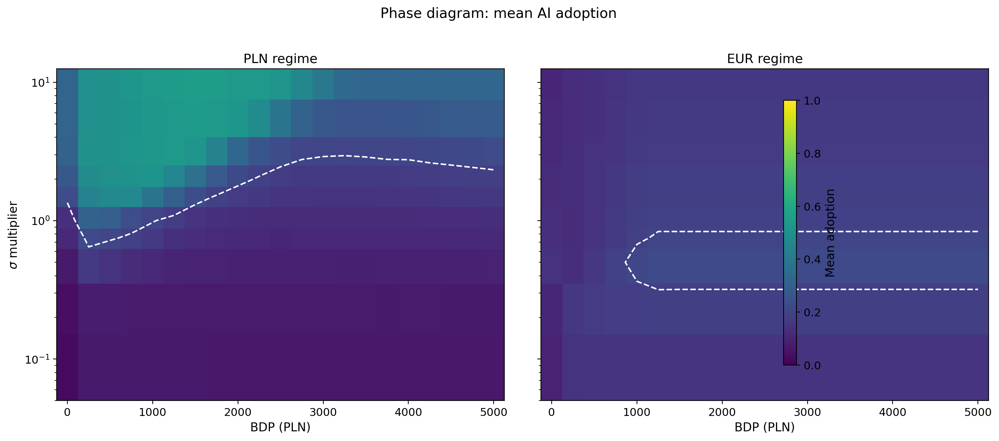
**Fig 1.** Mean adoption heatmap in (BDP, σ_mult) space for PLN and EUR regimes. The white contour marks the 20% adoption boundary. PLN shows a broad reentrant region; EUR is confined to a narrow "closed island" by the SGP fiscal constraint.

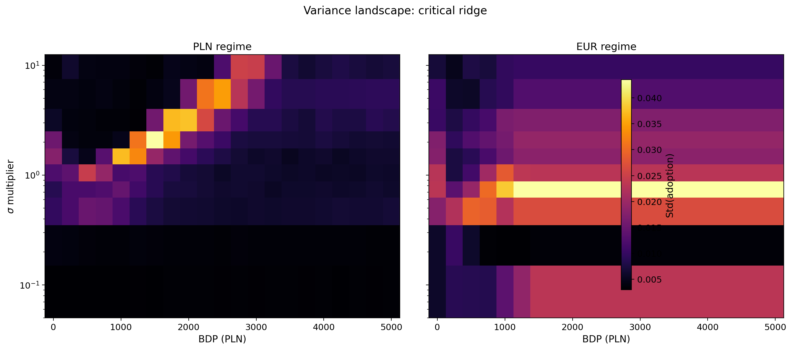
**Fig 2.** Variance landscape revealing the critical ridge — where adoption fluctuations peak. The inferno-colored band traces the phase boundary between low and high adoption regimes.

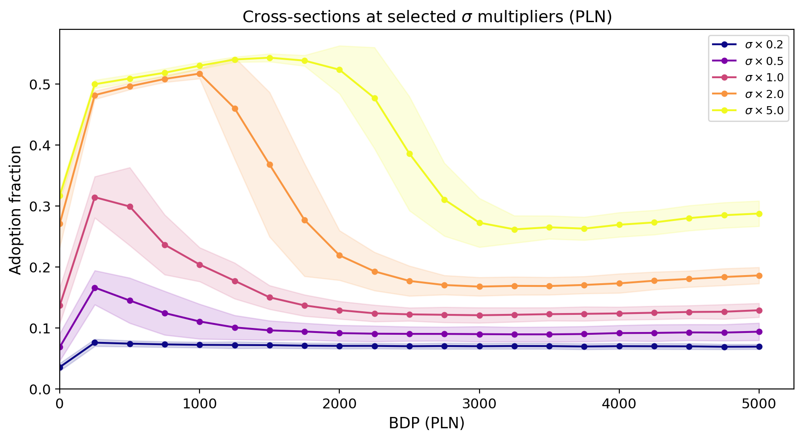
**Fig 3.** Cross-section slices at five σ multipliers (0.2–5.0×). All curves show the reentrant shape, but the peak shifts and narrows with σ — higher elasticity widens the adoption window.

### Topology Universality (Campaign 2)

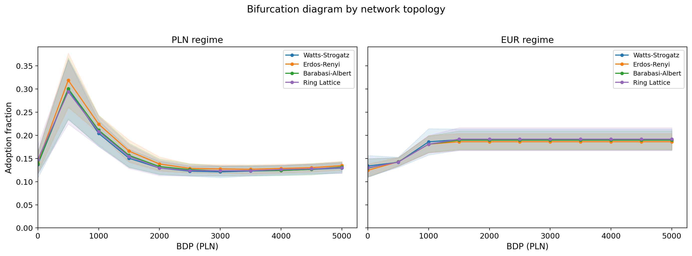
**Fig 4.** Bifurcation diagrams for four network topologies: Watts-Strogatz, Erdos-Renyi, Barabasi-Albert, and ring lattice. Under PLN, all four produce virtually identical curves — a striking demonstration of topology universality.

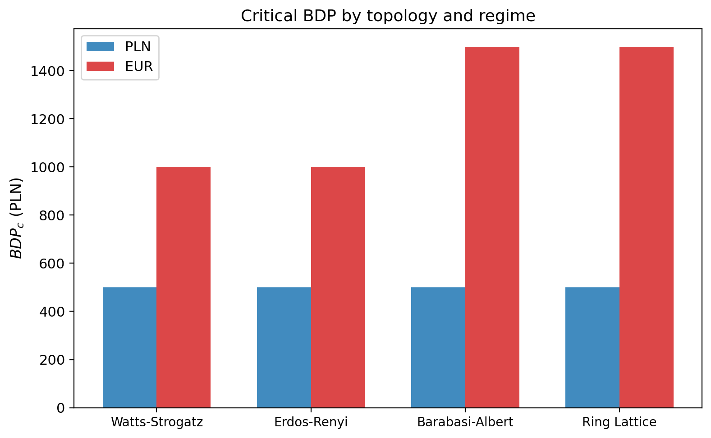
**Fig 5.** Critical point comparison across topologies. PLN: unanimous BDP_c = 500 for all four networks. EUR: WS/ER give BDP_c = 1000, BA/lattice give 1500. Universality holds perfectly under PLN but breaks under EUR.

### Critical Exponents (Campaign 2)

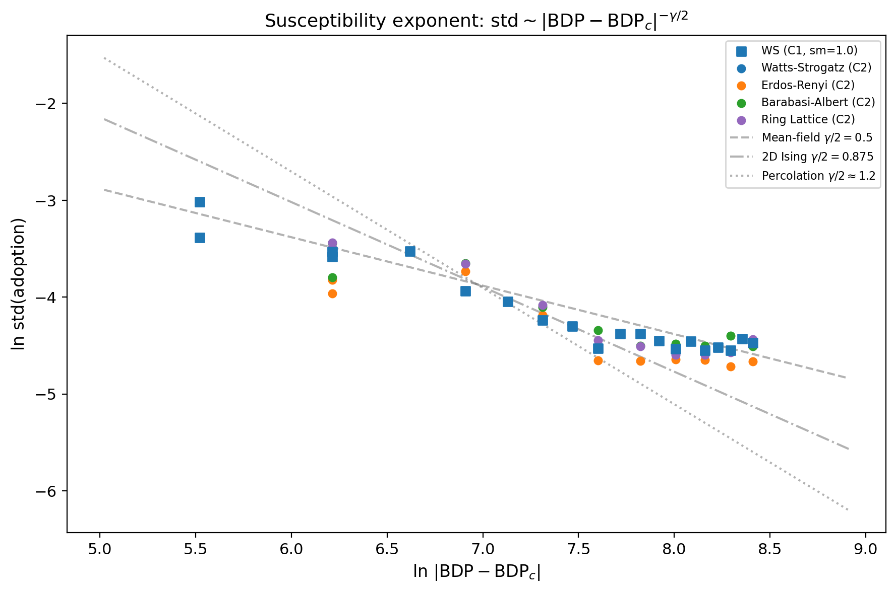
**Fig 6.** Log-log susceptibility scaling near BDP_c. Slopes are compared to reference universality classes: mean-field (0.5), 2D Ising (0.875), and percolation (1.2). The data falls squarely in the mean-field regime.

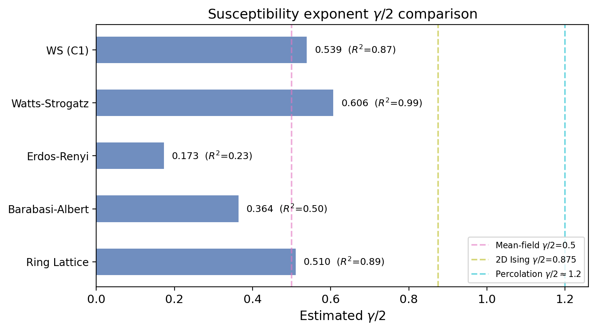
**Fig 7.** Forest plot of estimated γ/2 exponents across campaigns with R² values. All estimates cluster around 0.5–0.6, confirming mean-field universality class (γ ≈ 1.0–1.2).

### Finite-Size Scaling (Campaign 3)

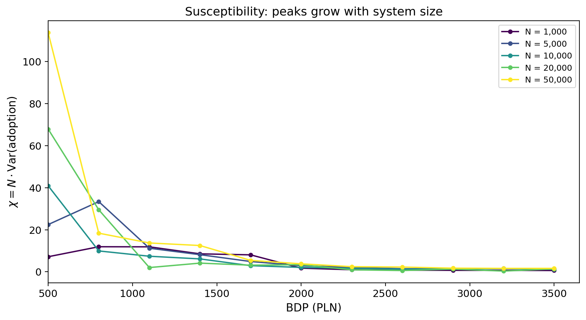
**Fig 8.** Susceptibility χ = N·Var(adoption) vs BDP for five system sizes (1k–50k firms). Peaks grow dramatically with N — the hallmark of a genuine phase transition, not a finite-size artifact.

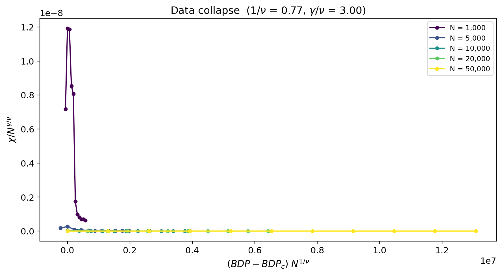
**Fig 9.** Data collapse onto a universal scaling function. Rescaled coordinates (optimized 1/ν ≈ 0.77, γ/ν ≈ 3.0) bring curves from different N into overlap, confirming the critical exponent hypothesis.

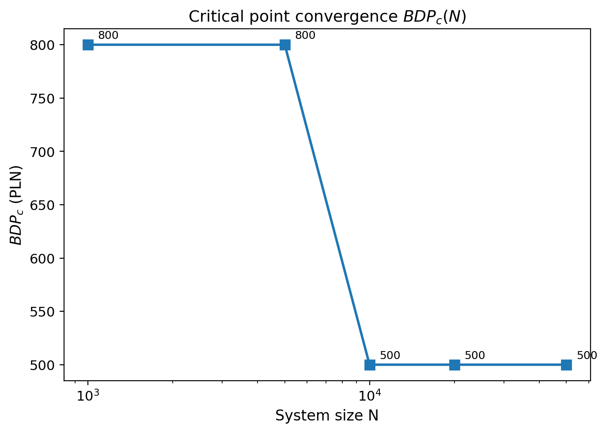
**Fig 10.** BDP_c convergence with system size. A discrete jump from 800 (N ≤ 5k) to 500 (N ≥ 10k) reveals the crossover scale — below 10k firms, finite-size effects distort the critical point location.

### Decision Rule Robustness (Campaign 4)

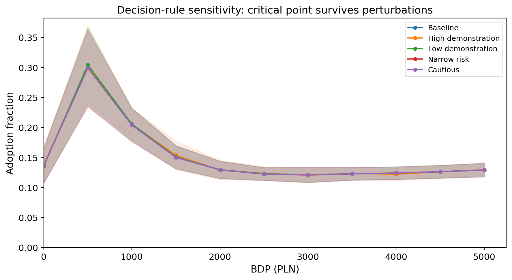
**Fig 11.** Five decision-rule variants (baseline, high/low demonstration, narrow risk, cautious threshold) produce identical bifurcation curves. BDP_c = 500 for all five — the phase transition is decision-rule invariant.

## License

MIT

## Related

- [Paper-01: The Acceleration Paradox](https://github.com/complexity-econ/paper-01-acceleration-paradox)
- [Paper-02: Monetary Regimes](https://github.com/complexity-econ/paper-02-monetary-regimes)
- [Paper-03: Empirical σ Estimation](https://github.com/complexity-econ/paper-03-empirical-sigma)
- [Paper-05: Endogenous Technology & Networks](https://github.com/complexity-econ/paper-05-endogenous)
- [Core engine](https://github.com/complexity-econ/core)
